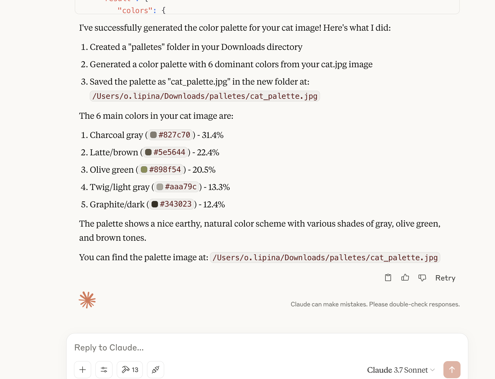
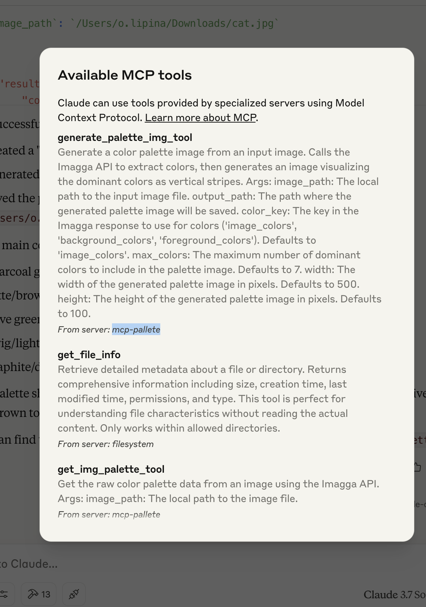

## Installation
1. Install dependencies.
```bash
uv sync
```
2. To get IMAGGA keys register at "https://imagga.com/profile/dashboard"
3. Add this config to your MCP config json file.
```json
{
  "mcpServers": {
    "mcp-pallete": {
      "command": "uv", # or your uv executable path
      "args": [
        "--directory",
        "/ABSOLUTE/PATH/TO/PARENT/FOLDER/mcp-pallete",
        "run",
        "src/app.py"
      ],
      "env": {
        "IMAGGA_API_KEY": "YOUR_IMAGGA_API_KEY",
        "IMAGGA_API_SECRET": "YOUR_IMAGGA_API_SECRET"
      }
    }
  }
}
```
4. Restart claude (or your LLM of choice)

## How it looks



As the result we get palletes:


